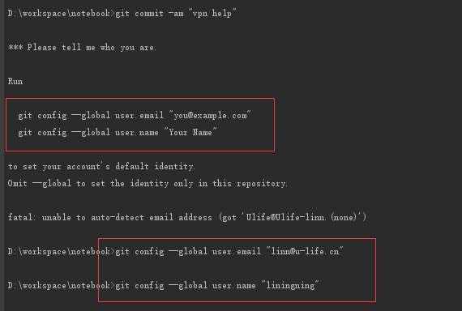
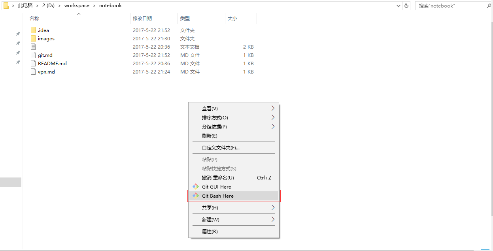
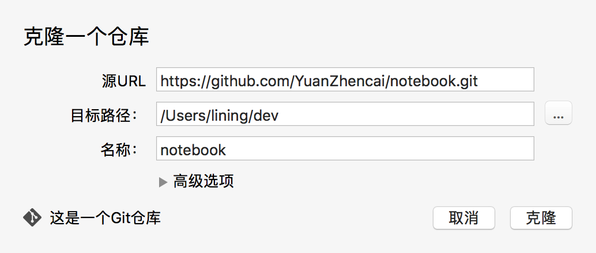

# Git

[首页](https://git-scm.com/)

## 文档

[Git Book](https://git-scm.com/book/zh/v2)

## 安装

1.  下载安装文件

    [下载](https://git-scm.com/downloads)

2.  运行安装文件，都是下一步即可

3.  设置环境变量，让cmd中也可以使用git command

    
     
4.  设置git 用户信息

    

5.  进入文件夹，右击鼠标，点击 `git bash here`， 运行 git bash
    
    

6.  基本概念

    * 本地仓库
    
    * 暂存区
    
    * 远端仓库
    
    * 分支

7.  常用命令，可以在Git Book 中查看具体怎么使用

        git init
        git clone https://github.com/YuanZhencai/notebook.git
        git remote -v
        git remote add
        git status
        git pull
        git add .
        git commit -am "init"
        git checkout -b "example"
        git merge
        git push
        
        
## SourceTree
   
[首页](https://www.sourcetreeapp.com/)

## 安装

[Mac](https://downloads.atlassian.com/software/sourcetree/SourceTree_2.6.2c.zip)

[Windows](https://downloads.atlassian.com/software/sourcetree/windows/ga/SourceTreeSetup-2.1.11.0.exe)

## 使用

* 打开 SourceTree

    

* 新建本地仓库

    
    
* 克隆远端仓库

    
    
* 导入已有仓库

    
    
* 查看工作空间

    
    
* 右击待定的文件，可以添加到暂存区

    

* 提交到本地仓库

    
    
* 推送到远端仓库

    

* 拉取远端仓库代码

    
